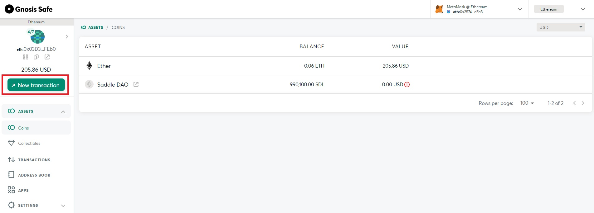
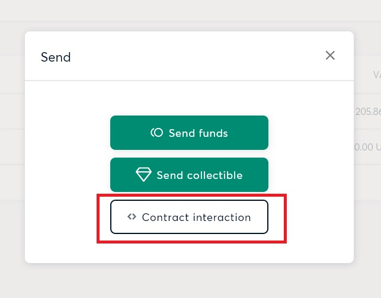
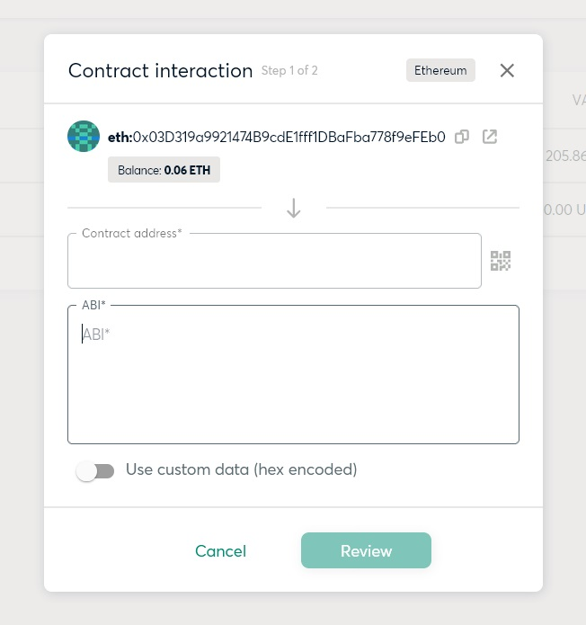
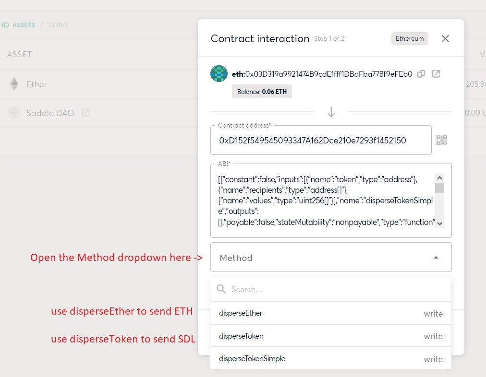
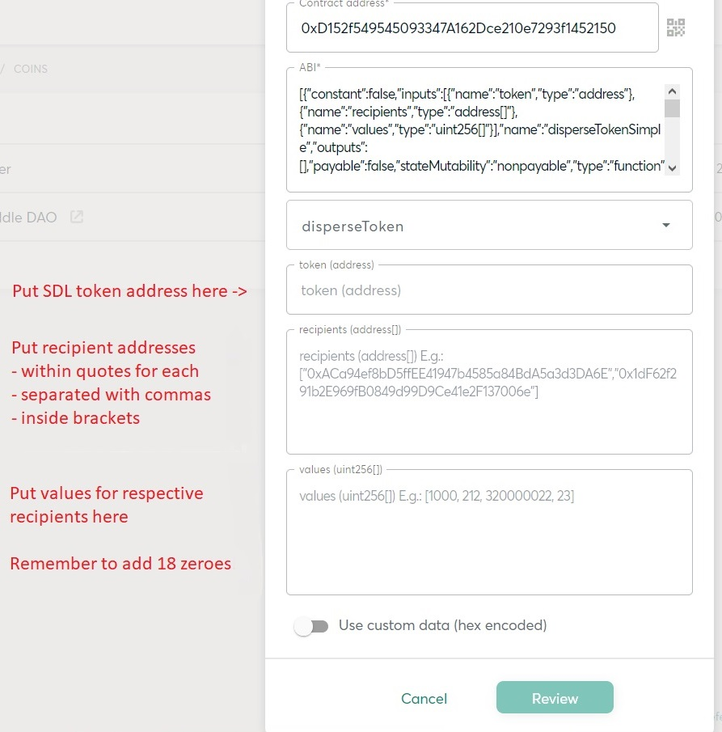
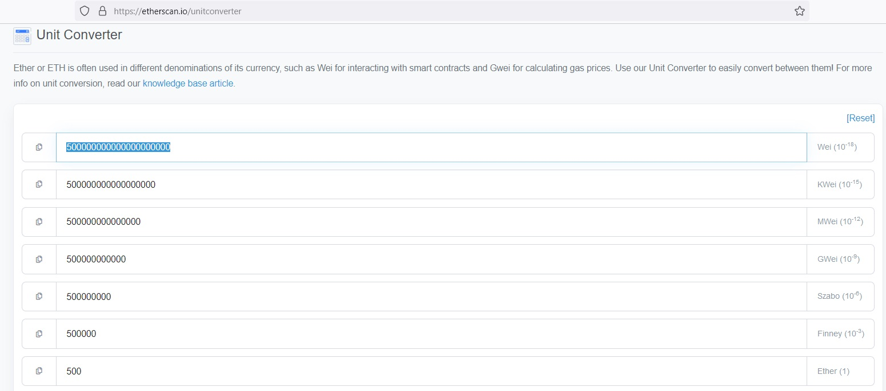
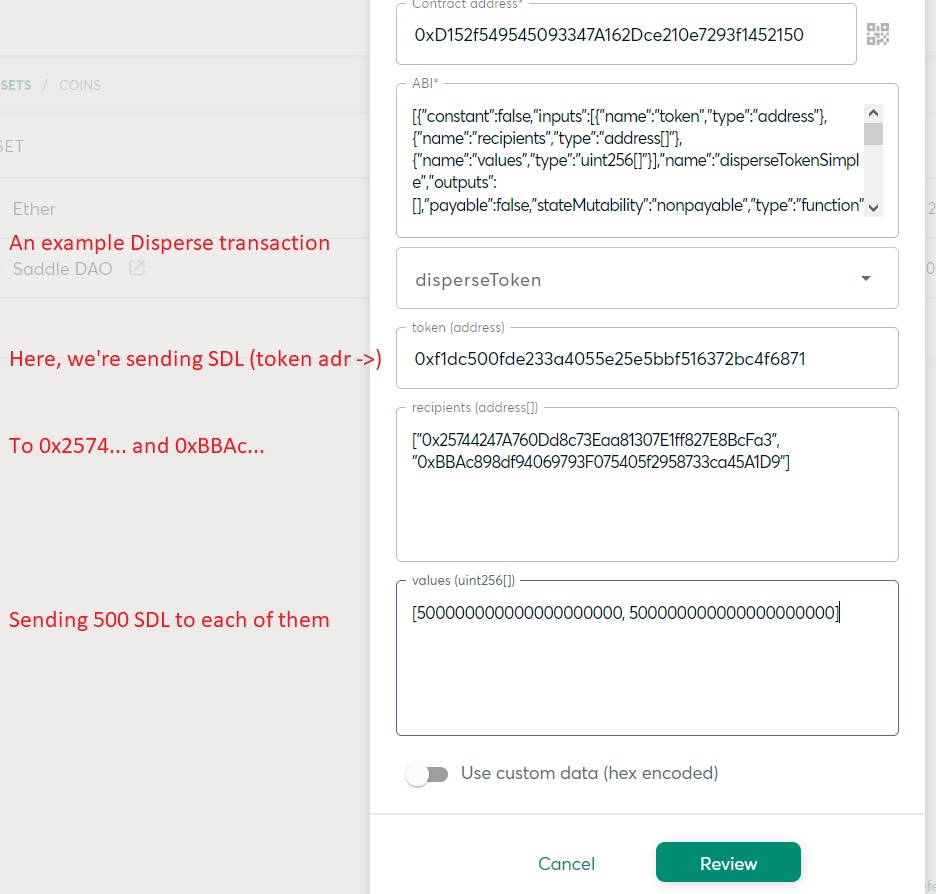
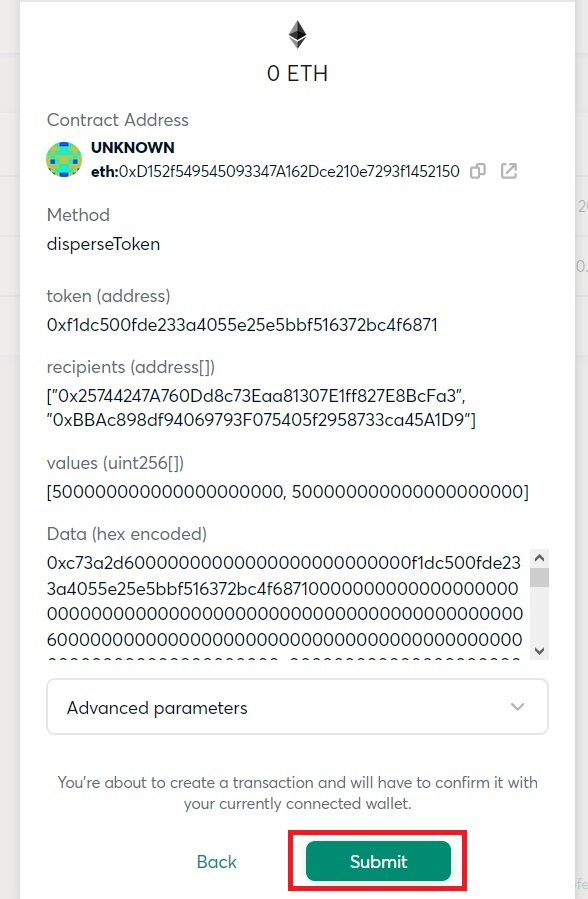

<h1>Using Disperse with Gnosis Safe</h1>

Steps:

1 - start a new transaction with contract interaction

2 - paste the Disperse contract address

3 - in the Method dropdown, select "disperseEther" to send ETH, or "disperseToken" to send SDL

4 - (optional) paste SDL token address, if you're sending SDL 

5 - paste recipient addresses in quotes, within a bracket array and separated by commas

6 - paste respective ether/token amounts, separated by commas. Add 18 zeroes to the number

7 - submit

<h3>Step 1 - Start a new transaction with Contract Interaction</h3>

Start a new transaction from the top left of the UI.

Select "contract interaction".

<h3>Step 2 - Paste the Disperse contract address</h3>
  
You will see this popup screen.
  

Paste the contract address (0xD152f549545093347A162Dce210e7293f1452150)
  

  
Gnosis Safe should fill up the ABI automatically. If it doesn't, refresh the page and start again.
  

  
<h3>Step 3 - Select "disperseEther" to send ETH, or "disperseToken" to send SDL</h3>
  
Open the Method dropdown.
  

<h3>Step 4-6 - Paste all parameters</h3>

If you're sending SDL, paste the SDL token address (0xf1dc500fde233a4055e25e5bbf516372bc4f6871).

Paste recipient addresses in quotes, within a bracket array and separated by commas

Paste respective ether/token amounts, separated by commas. Solidity doesn't handle decimals by default, so you will want to add 18 zeroes to each number.

Etherscan has a convenient unit converter at https://etherscan.io/unitconverter

  
Here's an example transaction, sending 500 SDL (1000 in total) to two addresses.

<h3>Step 7 - Submit</h3>

All there is left to do is submit the transaction.

This will prompt your wallet for a signature. Sign it.

That's it! You're done. 

Tag the rest of us in the Discord, so we can confirm the transaction. :)
