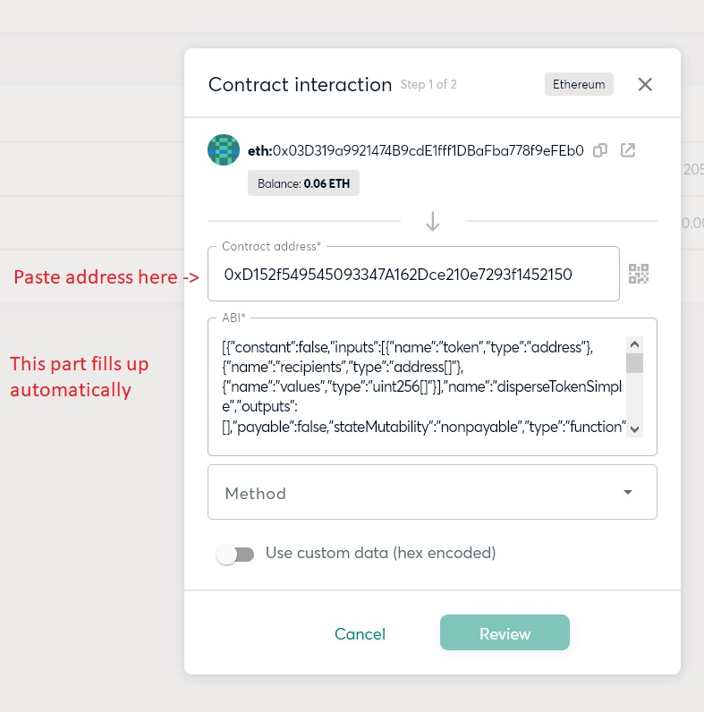

<h1>Using Disperse with Gnosis Safe</h1>

Steps:

1 - start a new transaction with contract interaction

2 - paste the Disperse contract address

3 - in the Method dropdown, select "disperseEther" to send ETH, or "disperseToken" to send SDL

4 - paste all parameters. 

SDL token address, if you're sending SDL.

Recipient addresses in quotes, within a bracket array and separated by commas

Respective ether/token amounts, separated by commas. Add 18 zeroes to the number (Solidity doesn't handle decimals by default)

<h3>Step 1 - Start a new transaction with Contract Interaction</h3>

Start a new transaction from the top left of the UI.

Select "contract interaction".

<h3>Step 2 - Paste the Disperse contract address
  
You will see this popup screen.
  

Paste the contract address (0xD152f549545093347A162Dce210e7293f1452150)
  

  
Gnosis Safe should fill up the ABI automatically. If it doesn't, refresh the page and start again.
  

  
<h3>Step 3 - Select "disperseEther" to send ETH, or "disperseToken" to send SDL
  
Open the Method dropdown.
  

  
